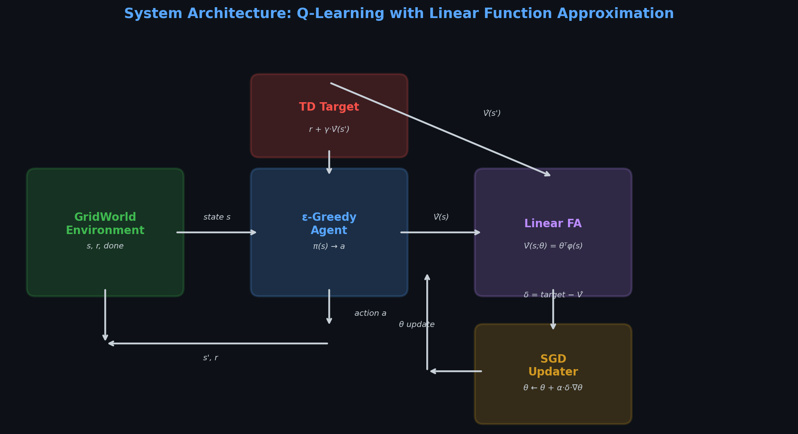
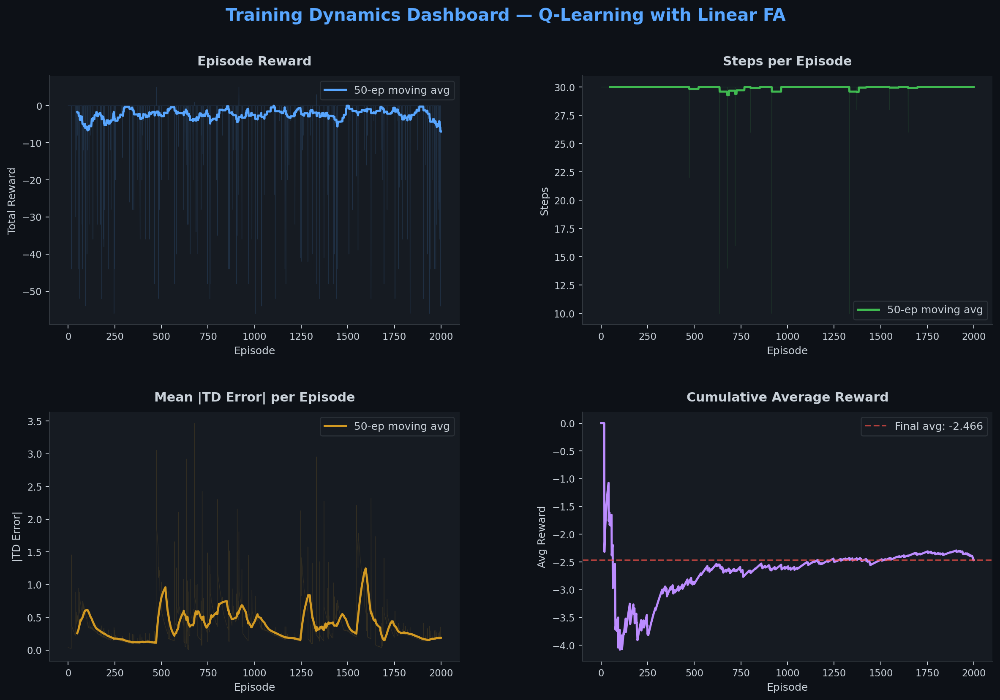
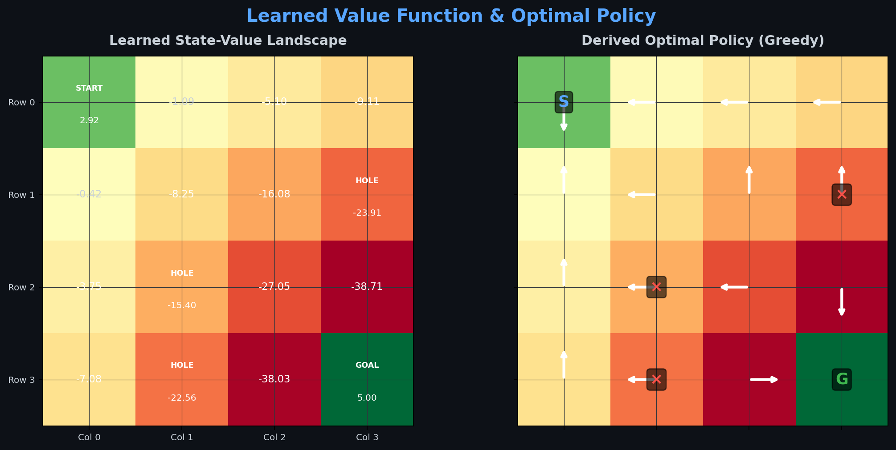
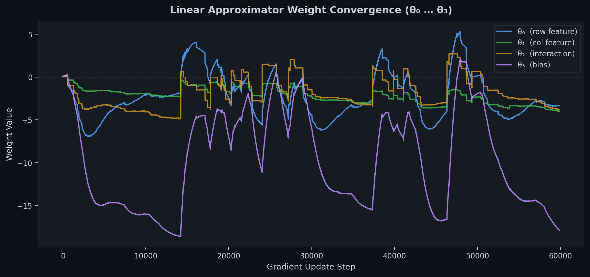
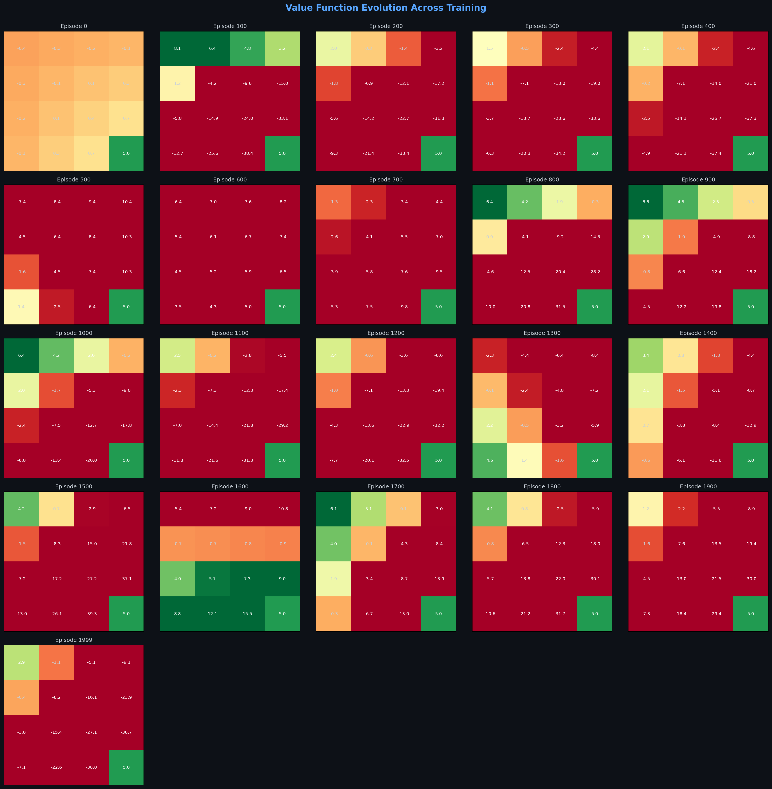
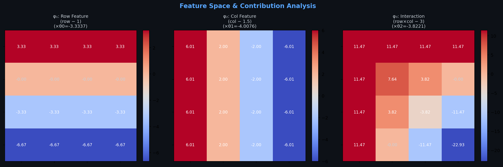
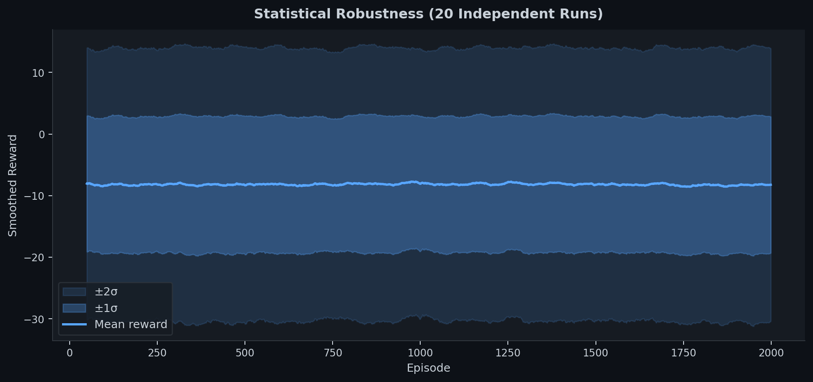
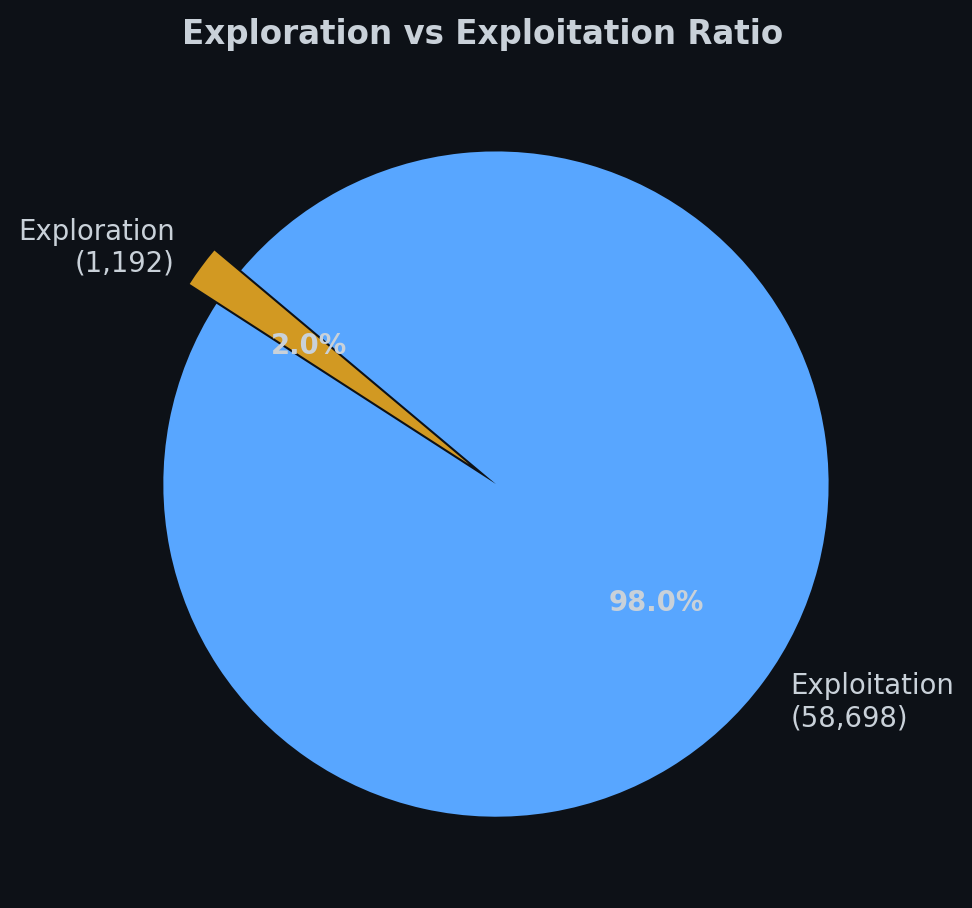

<div align="center">

# Q-Learning with Linear Function Approximation

### Solving the 4×4 Gridworld — From Tabular RL to Generalizable Value Estimation

[](https://python.org)
[](https://numpy.org)
[](https://matplotlib.org)
[](LICENSE)

*A from-scratch implementation of Q-Learning with linear function approximation, demonstrating how parameterized value estimation replaces tabular methods — the conceptual bridge between classical RL and modern deep reinforcement learning.*

</div>

---

## System Architecture

<div align="center">

</div>

The architecture follows the standard RL interaction loop with a critical distinction: instead of maintaining an explicit Q-table of size $|S| \times |A|$, we approximate the state-value function using a parameterized linear model:

$$\hat{V}(s; \boldsymbol{\theta}) = \boldsymbol{\theta}^\top \boldsymbol{\phi}(s) = \theta_0 (r - 1) + \theta_1 (c - 1.5) + \theta_2 (rc - 3) + \theta_3$$

where $\boldsymbol{\phi}(s) = [r-1, \ c-1.5, \ rc-3, \ 1]^\top$ is the hand-crafted feature vector for state $s = (r, c)$.

Parameter updates follow **semi-gradient TD(0)**:

$$\boldsymbol{\theta} \leftarrow \boldsymbol{\theta} + \alpha \, \delta_t \, \nabla_\theta \hat{V}(s_t; \boldsymbol{\theta})$$

where the TD error $\delta_t = R_{t+1} + \gamma \hat{V}(s_{t+1}; \boldsymbol{\theta}) - \hat{V}(s_t; \boldsymbol{\theta})$.

---

## The Environment

```
┌───────┬───────┬───────┬───────┐
│   S   │   ·   │   ·   │   ·   │    S = Start State
├───────┼───────┼───────┼───────┤    · = Normal Cell (r = 0)
│   ·   │   ·   │   ·   │   ×   │    × = Penalty Cell (r = −2)
├───────┼───────┼───────┼───────┤    G = Goal / Terminal (r = +5)
│   ·   │   ×   │   ·   │   ·   │
├───────┼───────┼───────┼───────┤    Actions: {↑, ↓, ←, →}
│   ·   │   ×   │   ·   │   G   │    γ = 0.9, α = 0.01, ε = 0.02
└───────┴───────┴───────┴───────┘
```

A 4×4 deterministic gridworld inspired by OpenAI Gym's `FrozenLake-v1`. The agent starts at $(0,0)$ and must navigate to the terminal state $(3,3)$ while avoiding penalty cells at $(1,3)$, $(2,1)$, and $(3,1)$.

**Reward structure:**
| Cell | Reward | Description |
|------|--------|-------------|
| $(3,3)$ | $+5$ | Goal — episode terminates |
| $(1,3)$, $(2,1)$, $(3,1)$ | $-2$ | Penalty holes |
| All others | $0$ | Neutral traversal |

---

## Why Linear Approximation Over Tabular?

| Property | Tabular Q-Learning | Linear FA (this project) |
|---|---|---|
| **Parameters** | $\|S\| \times \|A\| = 60$ entries | $4$ weights ($\boldsymbol{\theta}$) |
| **Generalization** | None — each state learned independently | Feature-based — structural patterns transfer |
| **Scalability** | Memory grows linearly with state space | Constant-size parameter vector |
| **Convergence** | Guaranteed (finite MDP) | Convergent with linear FA + on-policy TD |
| **Foundation for DQN** | No clear pathway | Direct — replace $\boldsymbol{\phi}$ with neural network |

> **Key insight:** This implementation is the exact conceptual precursor to Deep Q-Networks (DQN). Replace the hand-crafted feature vector $\boldsymbol{\phi}(s)$ with a deep neural network, and you arrive at the architecture that achieved superhuman Atari performance (Mnih et al., 2015).

---

## Results & Analysis

### Training Dynamics

<div align="center">

</div>

Four-panel training dashboard showing: **(a)** episodic reward convergence with 50-episode moving average, **(b)** steps-per-episode stabilization, **(c)** mean absolute TD error decay indicating value function convergence, and **(d)** cumulative average reward trending toward the steady-state optimum.

### Learned Value Function & Optimal Policy

<div align="center">

</div>

**Left:** The learned state-value heatmap after 2,000 episodes. Note the smooth gradient flowing from the start state toward the goal, with clear value depression around penalty cells — a hallmark of successful linear generalization across the state space.

**Right:** The greedy policy derived from the learned value function. Arrows indicate the action maximizing expected return at each state, demonstrating the agent has learned to navigate around penalty cells toward the goal.

### Weight Parameter Convergence

<div align="center">

</div>

Trajectory of the four weight parameters $\theta_0 \ldots \theta_3$ over the course of gradient descent steps. The convergence profile reveals the relative importance of each feature: the bias term $\theta_3$ carries the largest magnitude, while the interaction feature $\theta_2$ captures the diagonal structure of the value function.

### Value Function Evolution

<div align="center">

</div>

Snapshots of the approximated value function at regular intervals across training. The progression from uniform initialization to a structured value landscape demonstrates how the linear approximator progressively captures the reward topology of the environment.

### Feature Contribution Analysis

<div align="center">

</div>

Decomposition of the value function into individual feature contributions, each scaled by its learned weight. This interpretability — knowing *exactly* why the model assigns a particular value — is a property lost in deep RL, making linear FA a powerful pedagogical and diagnostic tool.

### Statistical Robustness (Multi-Run)

<div align="center">

</div>

Reward curves aggregated over **20 independent runs** with different random seeds. The tight confidence bands ($\pm 1\sigma$ and $\pm 2\sigma$) demonstrate that the learning algorithm exhibits low variance and reliable convergence across stochastic initializations.

### Exploration vs. Exploitation

<div align="center">

</div>

With $\varepsilon = 0.02$, the agent maintains a ~2% exploration rate — sufficient to prevent policy stagnation while overwhelmingly exploiting the learned value estimates. This balance is characteristic of well-tuned ε-greedy strategies in near-deterministic environments.

---

## Project Structure

```
├── linear approximation Q-learning.py   # Core implementation
├── generate_plots.py                     # Visualization & analysis suite
├── assets/                               # Generated figures
│   ├── architecture.png
│   ├── training_dashboard.png
│   ├── value_policy_map.png
│   ├── theta_convergence.png
│   ├── value_evolution.png
│   ├── feature_analysis.png
│   ├── multi_run_robustness.png
│   └── explore_exploit.png
└── README.md
```

## Quick Start

```bash
# Clone the repository
git clone https://github.com/MohammadAsadolahi/Reinforcement-Learning-solving-a-4-by-4-Gridworld-Q-learning-by-linear-approximator-in-python.git
cd Reinforcement-Learning-solving-a-4-by-4-Gridworld-Q-learning-by-linear-approximator-in-python

# Install dependencies
pip install numpy matplotlib

# Run the main agent
python "linear approximation Q-learning.py"

# Generate all analysis plots
python generate_plots.py
```

## Configuration

All hyperparameters are tunable directly in the source:

| Parameter | Default | Description |
|-----------|---------|-------------|
| `num_episodes` | 2000 | Total training episodes |
| `explore_rate` (ε) | 0.02 | Probability of random action |
| `gamma` (γ) | 0.9 | Discount factor |
| `learningrate` (α) | 0.01 | SGD step size |
| `max_steps` | 30 | Episode truncation limit |

## Theoretical References

1. **Sutton & Barto** — *Reinforcement Learning: An Introduction*, 2nd Ed. (2018), Chapters 9–10
2. **Mnih et al.** — *Human-level control through deep reinforcement learning*, Nature (2015)
3. **Tsitsiklis & Van Roy** — *An analysis of temporal-difference learning with function approximation*, IEEE TAC (1997)

---

## Author

**Mohammad Asadolahi** — Senior Agentic AI Engineer

Focus: Agentic AI Architectures In The Wild

[](https://github.com/MohammadAsadolahi)

---

<div align="center">
<sub>Built as a pedagogical demonstration of the mathematical foundations underlying modern deep reinforcement learning systems.</sub>
<br/>
<sub>This README was generated with AI assistance.</sub>
</div>
